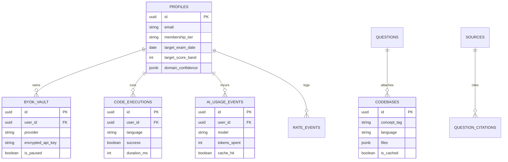

# 🎓 Claude Code Architect Certification Tutor (CCAF Prep)

[](https://react.dev/)
[](https://tanstack.com/)
[](https://supabase.com/)
[](https://www.typescriptlang.org/)
[](https://tailwindcss.com/)
[](https://pyodide.org/)
[](#-multi-account-synchronization)

> **Claude Code Architect Certification Tutor (CCAF Prep)** is a production-grade, AI-powered learning platform designed for software architects mastering Claude Code and agentic systems. Built on TanStack Start (React 19) and Supabase PostgreSQL with `pgvector`, the application features an interactive **CodeCanvas** environment with live in-browser execution (Pyodide WASM for Python and isolated Web Workers for JavaScript), a multi-agent AI mentor suite providing real-time voice streaming and line-by-line architectural breakdown matrices, and personalized FSRS spaced-repetition study plans powered by a candidate onboarding wizard. The system is engineered for enterprise security and scale, featuring tier-aware model routing, an encrypted server-side BYOK key vault (AES-256-GCM), automated daily rate-limiting guards, mobile-responsive accessible drawers (WCAG/ARIA), resilient route loading boundaries, router-level SEO with Open Graph cards, and hardened Supabase RLS security policies.

---

## 🌟 Key Feature Highlights

### 💻 1. CodeCanvas Live Execution Environment
- **Multi-File Syntax Highlighted Tabs:** Read-only and editable multi-file tabs for Python and JavaScript codebases.
- **In-Browser Execution Engine:**
  - **Python:** Client-side WASM execution via **Pyodide** with instant standard library support.
  - **JavaScript:** Isolated Web Worker sandbox execution via Blob Workers.
- **Execution Controls:** 10-second timeout enforcement, execution cancellation, live streaming console output (stdout/stderr/return values).
- **Diagnostic Tracebacks:** Line-number error highlighting, stack trace displays, and pre-run syntax validation hooks.
- **Telemetry Logging:** Owner-scoped `code_executions` database logging tracking latency, success rates, and payload metrics.

### 🤖 2. 5-Agent Autonomous Code Generation Loop
- **Multi-Agent Orchestration Pipeline:**
  1. **Research Agent:** Grounded library gap brief synthesis.
  2. **SME (Subject Matter Expert) Agent:** Code example generation.
  3. **Verifier Agent:** Static analysis & sandbox constraint verification.
  4. **Documentation Agent:** Line-by-line code walk generation.
  5. **Advice Generator Agent:** Multi-dimensional advice matrices (walks, design tradeoffs, misconception checks, concept linkages, follow-up questions).
- **Feedback & Retry Loop:** SME → Verifier loop retried up to 3 times with feedback; broken attempts discarded before saving to `codebases`.
- **Admin Live Stream Tracker:** Real-time multi-agent generation tracker in section 12 of the Admin Console.

### 🔐 3. Encrypted Server-Side BYOK Key Vault
- **AES-256-GCM Vault:** Encrypted storage for candidate operational Anthropic (Claude) and Google (Gemini) API keys.
- **Provider Verification:** Live API key verification and testing before saving.
- **Proxy Override Gates:** Active unpaused vault keys securely override proxy subscription balances, routing inference directly through the candidate's custom operational key.

### ⚡ 4. Model Routing, Usage Analytics & Rate Limits
- **Cache-First Model Routing:** Instant resolution via `ai_response_cache` and tier-aware model allocation (`profiles.membership_tier`).
- **AI Usage Analytics:** Detailed logging of token spend, cache hit rates, cost savings curves, and model breakdown charts in the Admin Usage Board.
- **Rate Constraint Guards:** Tier-based daily request/token quotas and burst throttles across mentor streams, codegen actions, and TTS calls (`rate_events`), with BYOK user exemptions.

### 🧠 5. Adaptive Learning Engine & Onboarding
- **Interactive Onboarding Wizard:** First-time candidate flow capturing target exam date, desired score band, weekly study hours, and self-assessed domain confidence.
- **FSRS Spaced Repetition:** Automated study plan seeding, review scheduling, and diagnostic pass probability forecasting bands.
- **Study Canvas Tabs:** Context-bound Code, Video, and Documentation sections tied to FSRS retention metrics.

### 📊 6. Admin Intelligence & Content Control Desk
- **Admin Usage Board (Section 16):** Cache hit ratios, credits spent vs. saved, model token volume trends.
- **Spider Control Desk (Section 13):** Catalogued source URL crawler with configurable crawl intervals and `Crawl_Due` batch triggers.
- **Corpus Defragmentation Sweep (Section 14):** Automated section consolidation, empty artifact stripping, and chunk re-embedding.
- **Coverage Parity Matrix (Section 15):** Bank composition vs. exam blueprint weights, difficulty mix, and citation tracking.

### 📱 7. Responsive UX, Accessibility & Resilience
- **Mobile Responsive Reflow:** Docks Study Canvas as a full-width bottom sheet on mobile screens (<768px) and turns Mentor frame into a full-screen drawer.
- **WCAG ARIA Accessibility:** Full `role="dialog"`, `role="tablist"`, `role="tab"`, `role="tabpanel"` attributes, focus containment traps (`useFocusSurface`), and arrow/Home/End keyboard navigation.
- **Global Shortcuts & Reduced Motion:** `Ctrl+Shift+C` / `Cmd+Shift+C` global Study Canvas toggle, `Escape` surface stack popping, and `prefers-reduced-motion` compliance.
- **Resiliency Boundaries:** Unified skeleton loaders (`QuestionSkeleton`, `DashboardSkeleton`, `TableSkeleton`, `AdminSkeleton`) and route-level error boundaries with retry handlers.

### 🌐 8. Router-Level SEO & Social Sharing
- **Metadata Generator:** Automated Open Graph (`og:title`, `og:description`, `og:image`), Twitter Cards, and canonical URL injection across all dynamic routes.
- **Social Card & Manifest:** Custom 1200×630 Open Graph preview card (`/public/og-card.jpg`) and PWA web manifest (`/public/site.webmanifest`).

### 🛡️ 9. Enterprise Security & RLS Hardening
- **Supabase Row Level Security (RLS):** Strict RLS policies across `profiles`, `byok_vault`, `ai_usage_events`, `codebases`, `code_executions`, `rate_events`, and `sources`.
- **Gated Access:** Answer keys restricted to published questions; BYOK vault locked strictly to service role and account owner.
- **Dependency Hygiene:** Clean vulnerability dependency audit (0 vulnerabilities).

---

## 🏗️ Architecture & Technology Stack

| Component | Technology | Purpose |
| :--- | :--- | :--- |
| **Frontend Framework** | [TanStack Start](https://tanstack.com/) + [React 19](https://react.dev/) | SSR/SSG file-based routing and server functions |
| **Styling & UI** | [TailwindCSS v4](https://tailwindcss.com/) + [Lucide Icons](https://lucide.dev/) | Terminal Blueprint design system & dark mode tokens |
| **Database & Auth** | [Supabase PostgreSQL](https://supabase.com/) | PostgreSQL with `pgvector`, RLS policies, & Auth |
| **In-Browser WASM** | [Pyodide WASM](https://pyodide.org/) | Client-side Python code execution engine |
| **JS Sandbox** | Web Worker / Blob Worker | Isolated JavaScript sandbox runner |
| **ORM & Migrations** | [Drizzle ORM](https://orm.drizzle.team/) | Type-safe schema definition & SQL migrations |
| **AI Integration** | Anthropic Claude 3.5 Sonnet / Google Gemini 1.5 Pro | Routed via managed gateway & BYOK keys |

---

## 🗄️ Database Schema Overview



---

## 🛠️ Quick Start & Local Development

### Prerequisites
- **Node.js**: `v20.0.0` or higher
- **Package Manager**: `npm` or `bun`

### 1. Clone & Install Dependencies
```bash
git clone https://github.com/Sree1959GIT/Claude-Code-Arch-Tutor-CC.git
cd Claude-Code-Arch-Tutor-CC
npm install
```

### 2. Configure Environment Variables
Create a `.env` file in the root directory:
```env
VITE_SUPABASE_URL=https://your-supabase-project.supabase.co
VITE_SUPABASE_ANON_KEY=your-supabase-anon-key
SUPABASE_SERVICE_ROLE_KEY=your-supabase-service-role-key
ENCRYPTION_SECRET=your-aes-256-gcm-secret-key
```

### 3. Run Development Server
```bash
npm run dev
```
Open [http://localhost:5173](http://localhost:5173) in your browser.

---

## 🔄 Multi-Account Synchronization

This repository operates under the **Collab-Work Multi-Account Synchronization Controller Protocol**, ensuring 100% tip commit parity across three mirrored developer repositories:

| Repository | Account | Branch | Tip Parity |
| :--- | :--- | :--- | :--- |
| [`Sree1959GIT/claude-code-coach-Lovable`](https://github.com/Sree1959GIT/claude-code-coach-Lovable) | `aaplweb.com` | `main` | 🟢 100% Synced |
| [`Sree1959GIT/remix-of-claude-code-coach`](https://github.com/Sree1959GIT/remix-of-claude-code-coach) | `jyopa.com` | `main` | 🟢 100% Synced |
| [`Sree1959GIT/Claude-Code-Arch-Tutor-CC`](https://github.com/Sree1959GIT/Claude-Code-Arch-Tutor-CC) | Primary | `main` | 🟢 100% Synced |

---

## 📄 License & Attribution

This project is open-source and available under the **MIT License**. Built with ❤️ using React 19, TanStack Start, Supabase, and Pyodide.
